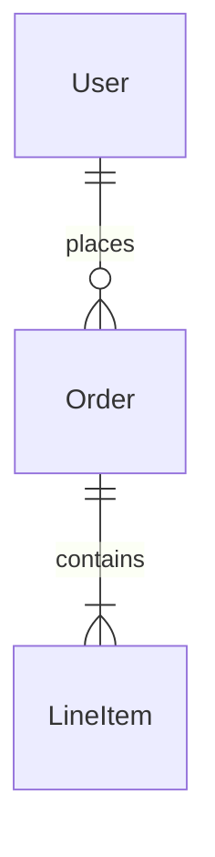
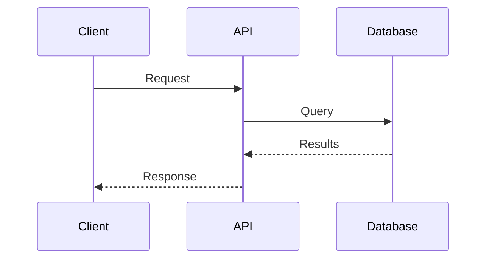

# Clarity Documentation Methodology

The goal is to bring **clarity to everything you touch**. When you enter a situation and make it clearer, you become invaluable.

## Core Principle

You have a **burden of responsibility** to provide the context people need to engage with a problem. If you're not providing that context, you're not making the situation clearer for anyone.

---

## When Asking for Help or Reporting Issues

Never send vague messages like "I can't get this working." Instead, always provide:

1. **What problem you're hitting** - The specific error message or unexpected behavior
2. **What you've tried** - Steps you've already taken to debug
3. **What happens** - Logs, screenshots, error output
4. **A theory** - Even if wrong; people like to correct theories, which gets them engaged

### Example - Bad

```
Hey, I can't get my server started
```

### Example - Good

```
Getting ECONNREFUSED when starting the dev server.

Tried:
- Verified port 3000 isn't in use
- Cleared node_modules and reinstalled
- Checked .env matches .env.example

Error output: [attached log]

Theory: Might be a Docker networking issue since I'm running Postgres in a container?
```

---

## Documentation Structure for Features/Tasks

For any work lasting more than a day, create documentation with these sections:

### Required Sections

**Background/Problem**

- What are you solving?
- Why does it matter?

**Terminology** (if needed)

- Define ambiguous terms so everyone uses the same language
- Prevents "groups vs clubs vs teams" confusion

**Goals and Non-Goals**

- Explicitly state what you're NOT doing
- Flushes out misconceptions early

**Solution**

- Your approach with diagrams (ER diagrams, sequence diagrams, flowcharts)
- Use Mermaid for diagrams - pictures communicate faster than words

**Known Steps / Remaining Unknowns**

- What you know vs. what you still need to figure out
- Treat it like a math problem: list your knowns and unknowns

**Questions**

- Product questions: Verify what product actually wants
- Engineering questions: Infrastructure, other team dependencies

**Resources**

- Links to relevant Slack threads, PRs, prior decisions

---

## The Documentation Lifecycle

### Version 1: Initial Understanding

- State what you know (even if incomplete)
- Draw the current system state
- List all your questions

### Version 2: Clarifications

- Update with answers to your questions
- Refine the ER diagram / system diagram
- Note decisions made and why

### Version 3: Implementation Ready

- Clear solution with diagrams
- Work broken into discrete pieces
- Integration points defined
- Test plan implicit from the spec

### Ongoing

- Push historical context (answered questions, old brainstorming) to a "Notes" section at bottom
- Keep current plan visible at top

---

## Decision History

**Always document WHY decisions were made with the data you had at the time.**

Example:

```
Decision: Using synchronous event processing
Reason: Believed the EventBus was async, but discovered it's actually synchronous
Date: 2024-01-15
```

When circumstances change and a decision looks wrong later, you can show it was reasonable given what you knew.

---

## PR Descriptions

If you've documented well during development:

- Copy/paste the problem description
- Reference the design doc
- Include before/after screenshots
- The PR practically writes itself

---

## Diagrams to Use

**ER Diagrams** - For data relationships



**Sequence Diagrams** - For API flows, auth flows, processes



**Screenshots with numbered annotations** - For UI work, add numbers and reference them in a list

---

## Key Mindset Shifts

1. **The doc is done when everyone's on the same page** - not when you finish writing

2. **Address unknowns BEFORE diving into code** - This can eliminate entire tickets

3. **Exploration ≠ Architecture** - It's fine to spike, but don't ship exploration code

4. **Break work into delegatable pieces** - If you're the only one who can do the work, you're your own blocker

5. **Writing the doc often solves the problem** - You frequently don't need to post the question because articulating it reveals the answer

---

## Red Flags to Avoid

- **Can't talk about a problem without talking about the whole world** - If you can't narrow it down, you'll touch everything
- **No written record of decisions** - You'll forget why you made them
- **Everyone thinks they're on the same page** - They're not, until there's a doc they've all reviewed
- **Accidental architecture** - Exploration that ships without proper design

---

## Quick Reference: Slack Messages

| Element | What to Include |
|---------|-----------------|
| Problem | Specific error or unexpected behavior |
| Tried | Steps you've already taken |
| Data | Logs, screenshots, error output |
| Theory | Your hypothesis (even if wrong) |

---

## Remember

> "To speed up, you have to slow down."

Documentation makes you faster because:

- You often solve the problem while writing it out
- You avoid building the wrong thing
- PR descriptions and test plans write themselves
- You become predictable and credible
- Sometimes you eliminate work entirely by asking the right questions first
